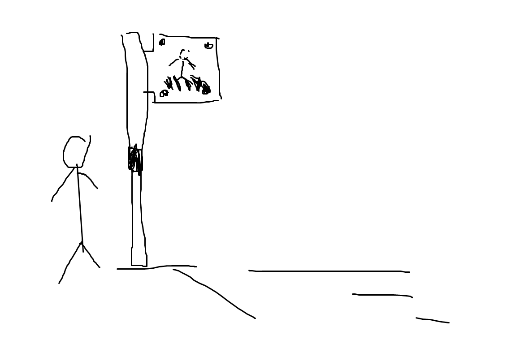
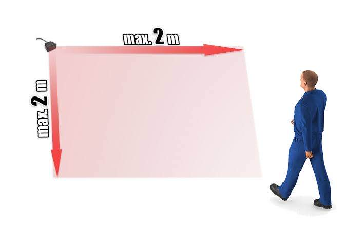

# Smart Pole Crosswalk
## Problem
	- รถสูงอาจจะมองไม่เห็นคนตัวเล็ก/เด็ก อาจจะเกิดอุบัติเหตุได้
	- ไม่กล้าข้ามถนนด้วยตัวเอง
	- ความประมาทของคนข้ามถนนและคนขับรถ
## Use
	- ติดไว้บริเวณทางม้าลาย
	- ถ้าจะข้ามถนน ให้ไปยืนใกล้ๆเสา
## Feature
	- ใช้กล้อง Detect ว่ารถบนถนนโล่งไหม 
		- ดูรถบนถนน
			- ดูความหนาแน่นของรถ
	- ใช้ Sensor
		- วัดค่า PM1.0/PM2.5/PM10
		- วัดค่า อุณหภูมิ
		- วัดค่า ความชื้น
		- วัดค่า แสงสว่าง
		- ตรวจจจับว่ามีคนจะข้ามถนนไหม
	- มี Speaker พูดว่าควรข้ามได้รึยัง สำหรับคนที่ชอบเดินเล่นโทรศัพท์
	- มีสัญญาณไฟ LED แจ้งเตือนคนจะข้ามถนน
		- มีสัญญาณไฟ 3 แบบ
			- คนขับรถ
			- คนข้ามถนน
			- ตอนกลางคืน
	- มี app / website
  	- รายงานว่า ตำแหน่งนี้มี
    	- ค่าฝุ่นเท่าไหร่
    	- ค่าอุณหภูมิ
    	- ค่าความชื้น
    	- ดูว่าตรงนี้การจราจจรหนาแน่นไหม [additional]
    	- ดูว่ารถตรงเส้นทางนี้ [additional]
## Ref
- Pole: 
  - 
  - Sensor Scan People:
    - Sensor: 
      - 
    - How it's work: 
      - 
	